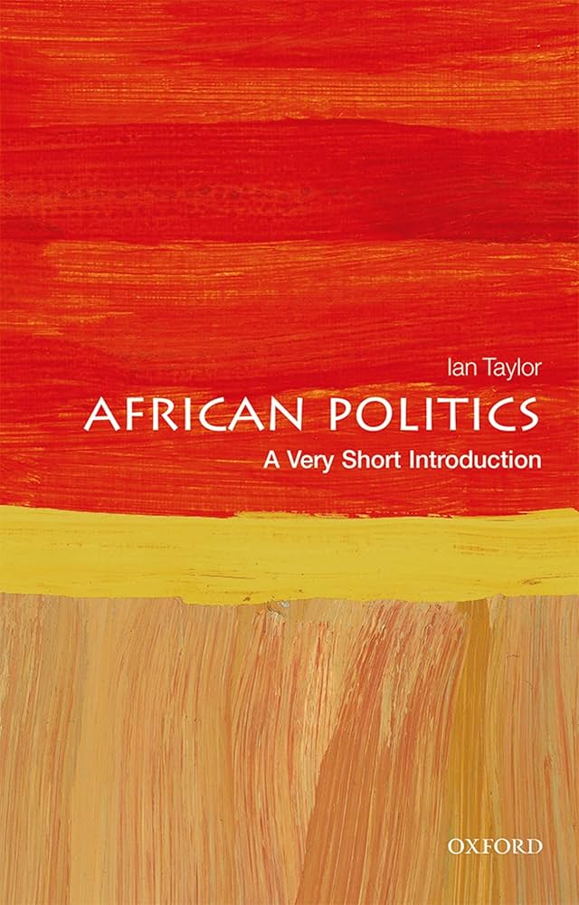
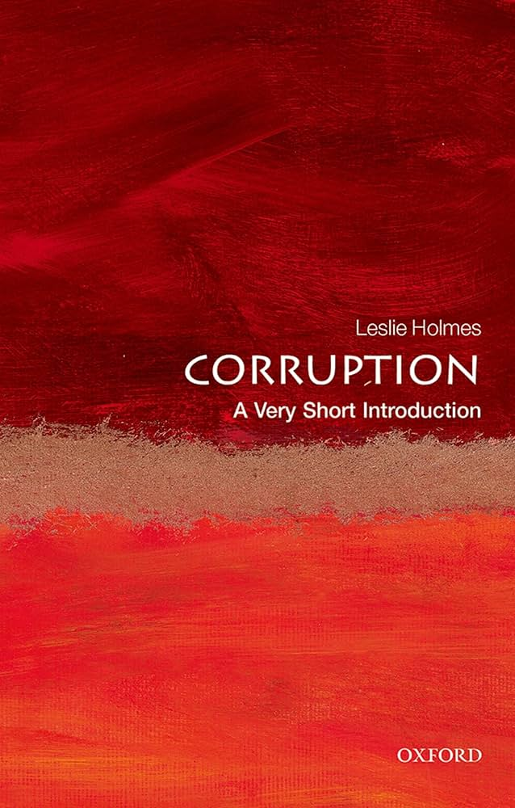
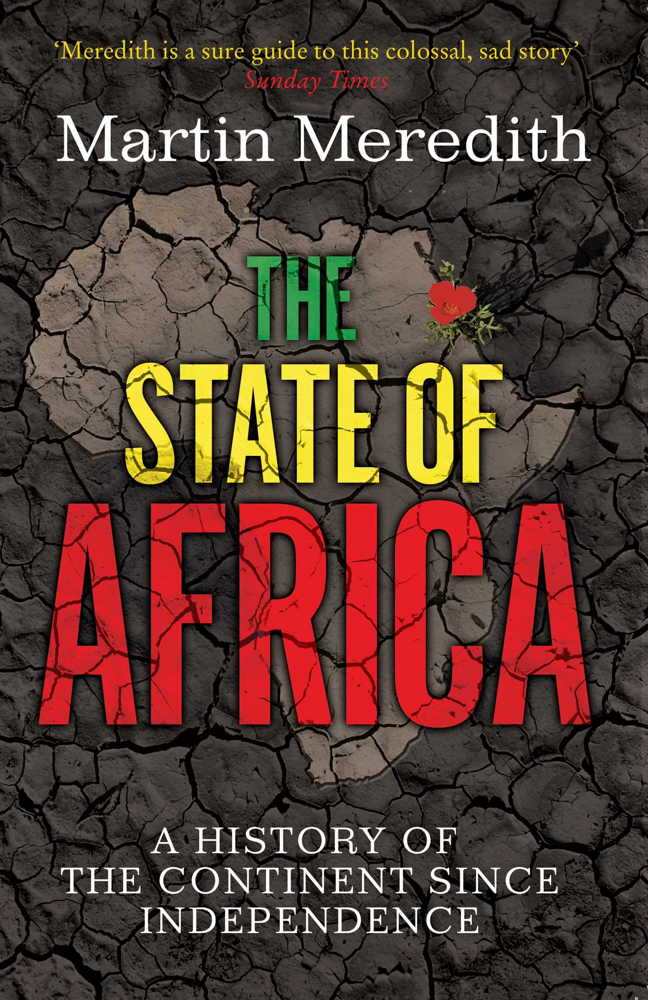
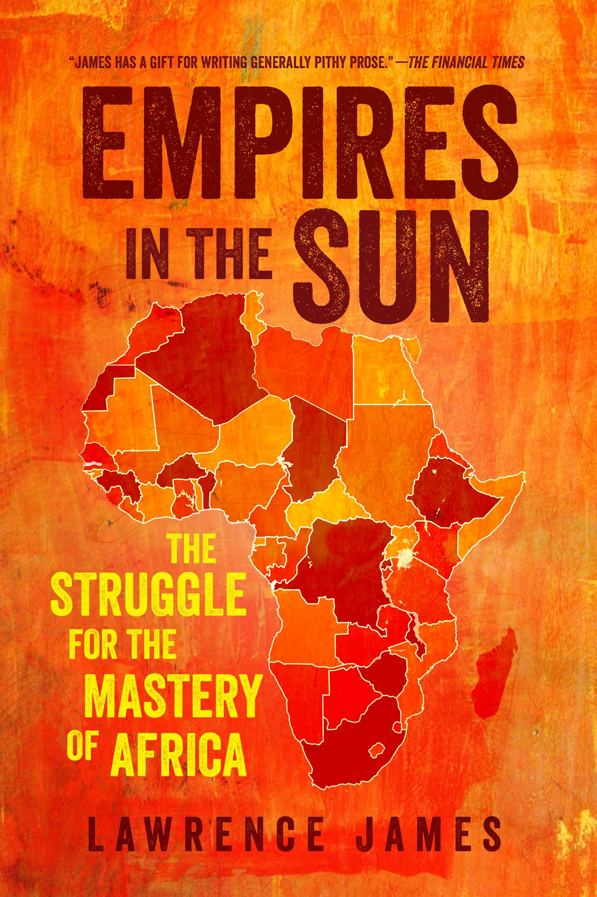
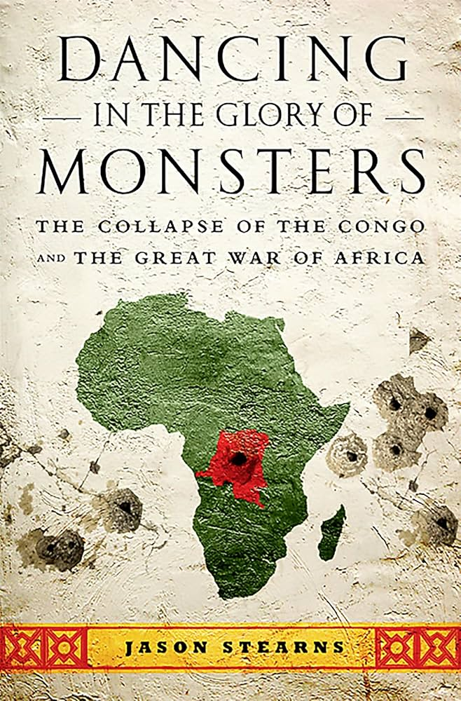

Challenges Faced by African Economic Development
=======================

* Corruption
    * defined as "abuse of public office for private gains"

* political instability
    * dictatorship
    * clientelism (exchange of favors for political support)
    * lack of democracy / democratic institutions

* lack of transparency
    * lack of reliable financial information
    * deters FDIs (foreign direct investments)

Proposed Solution
--------------------

* democratization of companies
* DAO
* anti-racism

Policies:

* Everyone should be allow to express their opinion freely
* No one can arbitrarily censor our organization's group discussions
* Bad behavior may be penalized but with a large margin of tolerance
* Abide to facts and scientific method which can be verified by AI (either immediately or retrogradely)
* ....

   

   

   

   

   

   

   